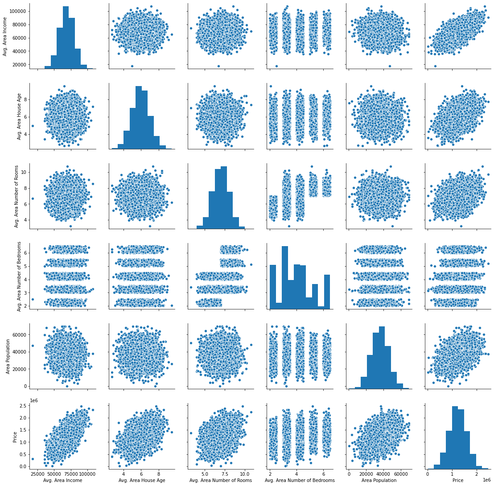
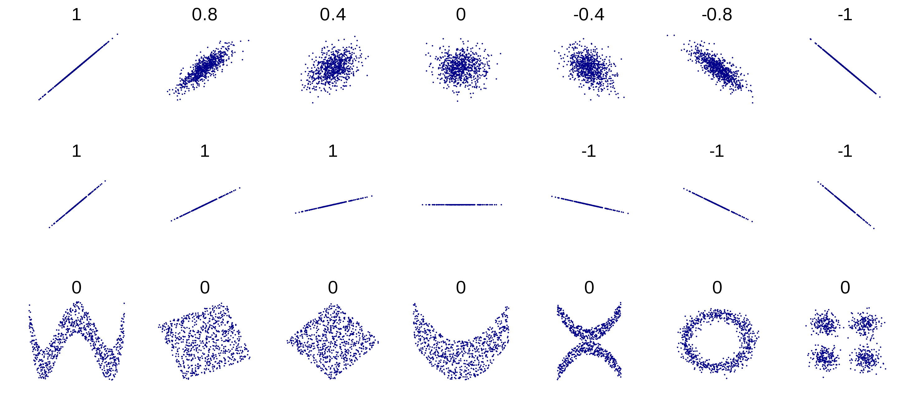
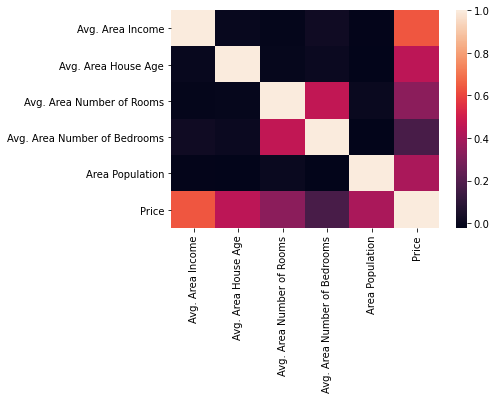

# 用mxnet预测美国不同区域房价
不久前经历了梯度爆炸，以为找到好的算法但是让人心碎的样本不够导致的训练不稳定（or 模型不稳定？），我们下载一个新的数据集看看我们会遇到什么别的难题。
## 读取数据集&导入所需的包


```python
%matplotlib inline
import d2lzh as d2l
from mxnet import autograd, gluon, init, nd
from mxnet.gluon import data as gdata, loss as gloss, nn
import numpy as np
import pandas as pd
import seaborn as sns
data = pd.read_csv('USA_Housing.csv')
```


```python
data.info()
```

    <class 'pandas.core.frame.DataFrame'>
    RangeIndex: 5000 entries, 0 to 4999
    Data columns (total 7 columns):
     #   Column                        Non-Null Count  Dtype  
    ---  ------                        --------------  -----  
     0   Avg. Area Income              5000 non-null   float64
     1   Avg. Area House Age           5000 non-null   float64
     2   Avg. Area Number of Rooms     5000 non-null   float64
     3   Avg. Area Number of Bedrooms  5000 non-null   float64
     4   Area Population               5000 non-null   float64
     5   Price                         5000 non-null   float64
     6   Address                       5000 non-null   object 
    dtypes: float64(6), object(1)
    memory usage: 273.6+ KB


一共5000个样本，5个变量
+ Avg. Area Income 人均收入
+ Avg. Area House Age  平均房龄
+ Avg. Area Number of Rooms  区域平均房间数量（不是整数）
+ Avg. Area Number of Bedrooms 区域平均睡房数量 （不是整数）
+ Area Population 区域人口
丢掉不需要的地址这个变量


```python
data = data.drop(['Address'], axis=1)
data.describe()
```


<div>
<style scoped>
    .dataframe tbody tr th:only-of-type {
        vertical-align: middle;
    }

    .dataframe tbody tr th {
        vertical-align: top;
    }

    .dataframe thead th {
        text-align: right;
    }
</style>
<table border="1" class="dataframe">
  <thead>
    <tr style="text-align: right;">
      <th></th>
      <th>Avg. Area Income</th>
      <th>Avg. Area House Age</th>
      <th>Avg. Area Number of Rooms</th>
      <th>Avg. Area Number of Bedrooms</th>
      <th>Area Population</th>
      <th>Price</th>
    </tr>
  </thead>
  <tbody>
    <tr>
      <th>count</th>
      <td>5000.000000</td>
      <td>5000.000000</td>
      <td>5000.000000</td>
      <td>5000.000000</td>
      <td>5000.000000</td>
      <td>5.000000e+03</td>
    </tr>
    <tr>
      <th>mean</th>
      <td>68583.108984</td>
      <td>5.977222</td>
      <td>6.987792</td>
      <td>3.981330</td>
      <td>36163.516039</td>
      <td>1.232073e+06</td>
    </tr>
    <tr>
      <th>std</th>
      <td>10657.991214</td>
      <td>0.991456</td>
      <td>1.005833</td>
      <td>1.234137</td>
      <td>9925.650114</td>
      <td>3.531176e+05</td>
    </tr>
    <tr>
      <th>min</th>
      <td>17796.631190</td>
      <td>2.644304</td>
      <td>3.236194</td>
      <td>2.000000</td>
      <td>172.610686</td>
      <td>1.593866e+04</td>
    </tr>
    <tr>
      <th>25%</th>
      <td>61480.562388</td>
      <td>5.322283</td>
      <td>6.299250</td>
      <td>3.140000</td>
      <td>29403.928702</td>
      <td>9.975771e+05</td>
    </tr>
    <tr>
      <th>50%</th>
      <td>68804.286404</td>
      <td>5.970429</td>
      <td>7.002902</td>
      <td>4.050000</td>
      <td>36199.406689</td>
      <td>1.232669e+06</td>
    </tr>
    <tr>
      <th>75%</th>
      <td>75783.338666</td>
      <td>6.650808</td>
      <td>7.665871</td>
      <td>4.490000</td>
      <td>42861.290769</td>
      <td>1.471210e+06</td>
    </tr>
    <tr>
      <th>max</th>
      <td>107701.748378</td>
      <td>9.519088</td>
      <td>10.759588</td>
      <td>6.500000</td>
      <td>69621.713378</td>
      <td>2.469066e+06</td>
    </tr>
  </tbody>
</table>
</div>


因为我们变量不是很多，只有5个，可以直接上seaborn 的[pairplot](https://seaborn.pydata.org/generated/seaborn.pairplot.html)来看看变量之间的关系：


```python
sns.pairplot(data)
```


    <seaborn.axisgrid.PairGrid at 0x113140208>





图中一些断口很齐的柱形图有点奇怪，仔细看也正常，是房间数跟睡房数的对比，睡房数怎么也不能超过房间数不是（机智）
其余的，收入与房价呈线性关系，情理之中
跟区域平均睡房数有关的每个图都可以清晰看出有2，3，4，5，6个睡房之分，且睡房数跟房价似乎没有什么联系，分布很平均。而房间数却都是圆形或者接近圆形的椭圆形，跟睡房的图不相像，这点有点出乎意料，
我们再来看看热力图，利用热力图(heatmap)可以看数据表里多个特征两两的相似度。

在概率论和统计学中，相关（Correlation），显示两个随机变量之间线性关系的强度和方向,这个数值的取值范围是(-1,1)，越靠近0，两个变量之间的关系越没有线性关系，如下图示：


```python
data.corr()
```


<div>
<style scoped>
    .dataframe tbody tr th:only-of-type {
        vertical-align: middle;
    }

    .dataframe tbody tr th {
        vertical-align: top;
    }

    .dataframe thead th {
        text-align: right;
    }
</style>
<table border="1" class="dataframe">
  <thead>
    <tr style="text-align: right;">
      <th></th>
      <th>Avg. Area Income</th>
      <th>Avg. Area House Age</th>
      <th>Avg. Area Number of Rooms</th>
      <th>Avg. Area Number of Bedrooms</th>
      <th>Area Population</th>
      <th>Price</th>
    </tr>
  </thead>
  <tbody>
    <tr>
      <th>Avg. Area Income</th>
      <td>1.000000</td>
      <td>-0.002007</td>
      <td>-0.011032</td>
      <td>0.019788</td>
      <td>-0.016234</td>
      <td>0.639734</td>
    </tr>
    <tr>
      <th>Avg. Area House Age</th>
      <td>-0.002007</td>
      <td>1.000000</td>
      <td>-0.009428</td>
      <td>0.006149</td>
      <td>-0.018743</td>
      <td>0.452543</td>
    </tr>
    <tr>
      <th>Avg. Area Number of Rooms</th>
      <td>-0.011032</td>
      <td>-0.009428</td>
      <td>1.000000</td>
      <td>0.462695</td>
      <td>0.002040</td>
      <td>0.335664</td>
    </tr>
    <tr>
      <th>Avg. Area Number of Bedrooms</th>
      <td>0.019788</td>
      <td>0.006149</td>
      <td>0.462695</td>
      <td>1.000000</td>
      <td>-0.022168</td>
      <td>0.171071</td>
    </tr>
    <tr>
      <th>Area Population</th>
      <td>-0.016234</td>
      <td>-0.018743</td>
      <td>0.002040</td>
      <td>-0.022168</td>
      <td>1.000000</td>
      <td>0.408556</td>
    </tr>
    <tr>
      <th>Price</th>
      <td>0.639734</td>
      <td>0.452543</td>
      <td>0.335664</td>
      <td>0.171071</td>
      <td>0.408556</td>
      <td>1.000000</td>
    </tr>
  </tbody>
</table>
</div>


```python
sns.heatmap(data.corr())
```


    <matplotlib.axes._subplots.AxesSubplot at 0x1a2c9abeb8>





```python
data.columns
```


    Index(['Avg. Area Income', 'Avg. Area House Age', 'Avg. Area Number of Rooms',
           'Avg. Area Number of Bedrooms', 'Area Population', 'Price'],
          dtype='object')


颜色越深代表两个变量之间关联越小。
## 流程跑起来
按照和上次一样的流程，我们用gluon最简单的线性回归跑一遍。


```python
data_1 = data.apply(
    lambda x: (x - x.mean()) / (x.std()))

data_1.fillna(0);
n_train=4600
train_features = nd.array(data_1[['Avg. Area Income', 'Avg. Area House Age', 'Avg. Area Number of Rooms',
       'Avg. Area Number of Bedrooms', 'Area Population']][:n_train].values)
test_features = nd.array(data_1[['Avg. Area Income', 'Avg. Area House Age', 'Avg. Area Number of Rooms',
       'Avg. Area Number of Bedrooms', 'Area Population']][n_train:].values)
train_labels = nd.array(data.Price[:n_train].values).reshape((-1, 1))
test_labels = nd.array(data.Price[n_train:].values).reshape((-1, 1))

net = nn.Sequential()
net.add(nn.Dense(1))
net.initialize(init.Normal(sigma=0.01))
loss = gloss.L2Loss()
trainer = gluon.Trainer(net.collect_params(), 'sgd', {'learning_rate': 0.03})
batch_size=60
train_iter = gdata.DataLoader(gdata.ArrayDataset(train_features, train_labels), batch_size, shuffle=True)
num_epochs = 50
for epoch in range(1, num_epochs + 1):
    for X, y in train_iter:
        with autograd.record():
            l = loss(net(X), y)
        l.backward()
        trainer.step(batch_size)
    l = loss(net(train_features), train_labels)
    print('epoch %d, loss: %f' % (epoch, l.mean().asnumpy()))
```

    epoch 1, loss: 13001314304.000000
    epoch 2, loss: 5210733568.000000
    epoch 3, loss: 5121718272.000000
    epoch 4, loss: 5123902464.000000
    epoch 5, loss: 5121267200.000000
    epoch 6, loss: 5120667136.000000
    epoch 7, loss: 5121507840.000000
    epoch 8, loss: 5121604096.000000
    epoch 9, loss: 5120654848.000000
    epoch 10, loss: 5123732992.000000
    epoch 11, loss: 5120560128.000000
    epoch 12, loss: 5122605568.000000
    epoch 13, loss: 5121635840.000000
    epoch 14, loss: 5120224256.000000
    epoch 15, loss: 5120880640.000000
    epoch 16, loss: 5120074752.000000
    epoch 17, loss: 5123029504.000000
    epoch 18, loss: 5121792512.000000
    epoch 19, loss: 5125493248.000000
    epoch 20, loss: 5121835008.000000
    epoch 21, loss: 5123636736.000000
    epoch 22, loss: 5126284800.000000
    epoch 23, loss: 5121441280.000000
    epoch 24, loss: 5122729472.000000
    epoch 25, loss: 5119861248.000000
    epoch 26, loss: 5122215424.000000
    epoch 27, loss: 5121710080.000000
    epoch 28, loss: 5120787456.000000
    epoch 29, loss: 5126288896.000000
    epoch 30, loss: 5126191104.000000
    epoch 31, loss: 5123052032.000000
    epoch 32, loss: 5120298496.000000
    epoch 33, loss: 5122872832.000000
    epoch 34, loss: 5121721856.000000
    epoch 35, loss: 5120057856.000000
    epoch 36, loss: 5120746496.000000
    epoch 37, loss: 5120456192.000000
    epoch 38, loss: 5120798720.000000
    epoch 39, loss: 5120084480.000000
    epoch 40, loss: 5120457728.000000
    epoch 41, loss: 5121451520.000000
    epoch 42, loss: 5124271616.000000
    epoch 43, loss: 5122580992.000000
    epoch 44, loss: 5122071040.000000
    epoch 45, loss: 5122051584.000000
    epoch 46, loss: 5122876928.000000
    epoch 47, loss: 5120893952.000000
    epoch 48, loss: 5121079296.000000
    epoch 49, loss: 5124863488.000000
    epoch 50, loss: 5121606144.000000


loss已经不能再降了还是那么大，其实可能只是我觉得很大，实际上结果还算可以？从根本上出发，我们看看这个[L2Loss](https://mxnet.apache.org/api/python/docs/api/gluon/loss/index.html#mxnet.gluon.loss.L2Loss)是何方神圣！
原来是误差的平方之和：
预测值原来已经精确到万了，再确认一下：


```python
net(test_features)[0:5]
```


    
    [[1487526.6 ]
     [ 883997.44]
     [1046983.1 ]
     [1513461.8 ]
     [1227524.1 ]]
    <NDArray 5x1 @cpu(0)>


```python
test_labels[0:5]
```


    
    [[1414259.8]
     [ 826483.7]
     [1079951.1]
     [1545961.6]
     [1374117.1]]
    <NDArray 5x1 @cpu(0)>


```python
(net(test_features)-test_labels)[0:5]
```


    
    [[  73266.875]
     [  57513.75 ]
     [ -32968.   ]
     [ -32499.875]
     [-146593.   ]]
    <NDArray 5x1 @cpu(0)>


```python
((net(test_features)-test_labels)**2)[0:5]
```


    
    [[5.36803482e+09]
     [3.30783155e+09]
     [1.08688896e+09]
     [1.05624186e+09]
     [2.14895084e+10]]
    <NDArray 5x1 @cpu(0)>


```python
y_predit=net(test_features)
l = loss(y_predit, test_labels)
print(l.mean().asnumpy())
```

    [4.9994583e+09]


测试集算出来的loss也跟训练集的是一个数量级的，没有过拟合，我对准确度也基本满意，毕竟是一个只有五个变量的数据集。拿比赛用来评价模型的标准来看看，使用的是对数均方根误差。给定预测值$\hat y_1, \ldots, \hat y_n$和对应的真实标签$y_1,\ldots, y_n$，它的定义为

$$\sqrt{\frac{1}{n}\sum_{i=1}^n\left(\log(y_i)-\log(\hat y_i)\right)^2}.$$

对数均方根误差的实现如下：


```python
def log_rmse(net, features, labels):
    # 将小于1的值设成1，使得取对数时数值更稳定
    clipped_preds = nd.clip(net(features), 1, float('inf'))
    rmse = nd.sqrt(2 * loss(clipped_preds.log(), labels.log()).mean())
    return rmse.asscalar()
```


```python
score=log_rmse(net,test_features,test_labels)
```


```python
print(score)
```

    0.09834387


我再拿kaggle上这个数据集的kernel的验证方法试试我的结果，不知怎的r2_score不能用在mxnet的ndarray上，我们自己写一个，啾


```python
def r2_score(y_predit,y_true):
    return 1-((y_true-y_predit)**2).sum()/((y_true-y_true.mean())**2).sum()
```


```python
r2_score(y_predit,test_labels)
```


    
    [0.9101527]
    <NDArray 1 @cpu(0)>


跟[别人](https://www.kaggle.com/faressayah/linear-regression-house-price-prediction)用sklearn计算的结果是一样的，我很满意
## 总结
自己一步一个脚印用另一个框架得到该有的结果是一件让人很开心的事情，从中熟悉了框架的结构，输入该用什么格式，怎么分析输出，参数的改变对计算有什么影响，等等。从简单到复杂，并不是一蹴而就的，中间经历过错误，再翻书感觉更容易看入脑。
## 明天预告
+ 用别的算法
